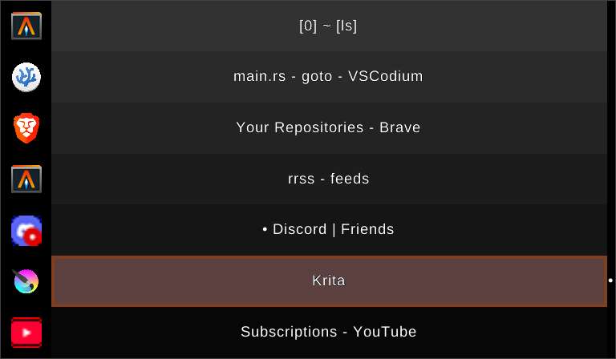

# Goto

A task switcher for X11, inspired by [alttab](https://github.com/sagb/alttab)



## Usage

```bash
$ goto
```

## Configuration

```
# $HOME/.config/goto/config

font_1: /absolute/path/to/a/font
font_2: /absolute/path/to/a/font
font_3: /absolute/path/to/a/font
font_size: 11
line_height: 1.1
text_halign: center
text_valign: center

location: 5
width: 40%
bg_color: #1d2021
border_color: #ffffff
border_width: 1

marker: •
marker_width: 20
marker_bg_color: #000000
marker_fg_color: #ffffff

show_icons: true
icon_padding: 15%
icon_border_width: 0
icon_border_color: #909090

task_height: 64
task_bg_color: #1d2021
task_fg_color: #ffffff
task_border_color: #909090
task_border_width: 0
task_gradient: true

selected_task_bg_color: #333333
selected_task_fg_color: #ffffff
selected_task_border_color: #ff0000
selected_task_border_width: 6

key_quit: Escape
key_next: Tab
key_prev: backslash
key_kill: k
key_mod: Alt_L
```
